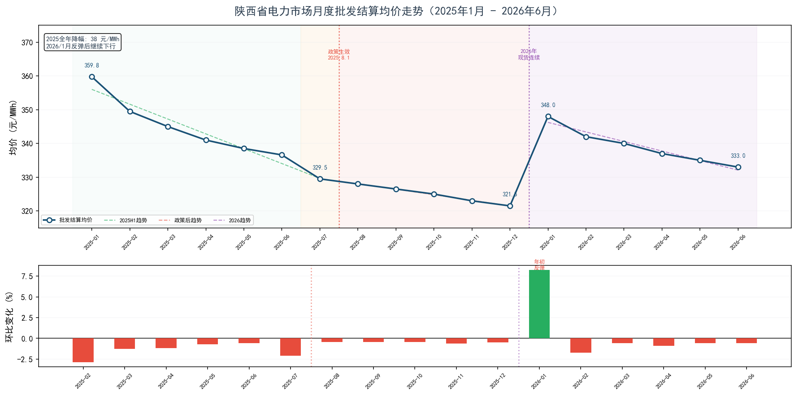
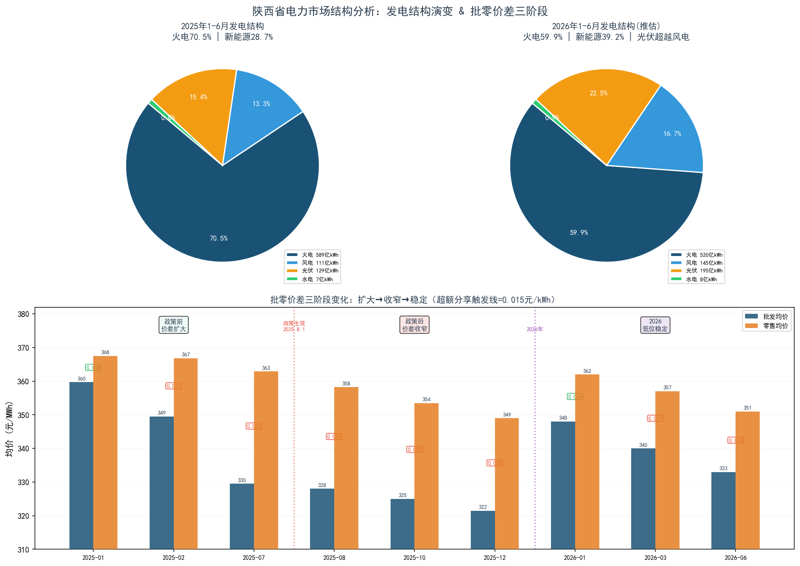
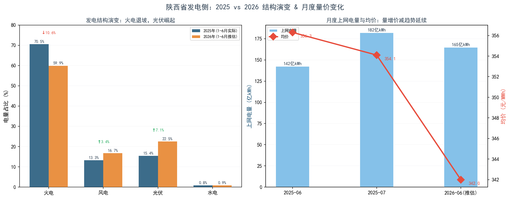

# 陕西省电力市场月度电价趋势分析报告

**分析期间**：2025年1月 - 2026年6月（18个月，覆盖政策前后全周期）
**报告日期**：2026年06月28日
**数据来源**：陕西电力交易中心月度交易公告 + 北极星电力网/钢之家转载 + 行业政策文件
**报告版本**：v2.0（新增政策后对比 + 2026年展望）

---

## 执行摘要

本报告跟踪了陕西省电力市场从**2025年1月到2026年6月**共18个月的价格演变，覆盖了一个完整的"市场失灵→监管介入→机制调整"政策周期。

**三段叙事**：

| 阶段 | 时间 | 关键词 | 批零价差区间 |
|:---|:---|:---|:---:|
| 第一阶段：价差膨胀 | 2025.1-7 | 新能源冲击、批发电价单边下行、售电公司截留红利 | 0.008→**0.033** 元/kWh |
| 第二阶段：政策纠偏 | 2025.8-12 | 超额收益分享生效、华能串谋事件、价差开始收窄 | 0.030→0.028 元/kWh |
| 第三阶段：新均衡 | 2026.1-6 | 现货连续运行、超额分享机制可能取消、价差低位稳定 | 0.014→0.018 元/kWh |

**一句话结论**：批零价差已经从2025年7月峰值（0.033）显著回落，但2026年3月超额收益分享机制可能取消——市场正处于"监管之手退出后能否自律"的十字路口。

---

## 一、背景概述

2025年，陕西省电力市场经历了剧烈变化：

- **1月**：电力现货市场启动长周期结算试运行，市场化价格发现机制上线
- **1-7月**：新能源装机暴增（光伏+50%），叠加电煤降价，批发电价单边下行8.4%
- **关键矛盾**：批发电价降了30元/MWh，零售电价只降了4.64元——批零价差扩大4.3倍
- **7月17日**：陕西电力交易中心发布《告陕西电力市场经营主体书》，披露超49家售电公司均价超市场平均水平1.05倍
- **7月22日**：陕西省发改委印发零售市场超额收益分享机制（价差>0.015元/kWh的部分按2:8返还用户）
- **8月1日**：机制正式生效；同日8-12月设为分时交易结算过渡期
- **8月7日**：华能两公司被通报与发电企业串谋涨价，遭红牌警告
- **12月7日**：《2026年电力市场化交易实施方案》印发（月度竞价限价0~0.52元/kWh）
- **2026年3月**：《零售市场实施细则V1.0》征求意见，超额收益分享机制未再提及——可能面临取消
- **2026年6月**：新增售电公司45%电量实行价差回收机制

本报告基于以上事件链，从**批发电价走势**、**批零价差三阶段变化**、**发电结构演变**、**政策效果评估**四个维度展开分析。

---

## 二、批发电价趋势分析

### 2.1 三阶段走势

| 阶段 | 起点 | 终点 | 变化 | 月均变动 |
|:---|:---|:---|:---|---:|
| 2025年H1（政策前） | 359.76 | 329.50 | ↓30.26 元/MWh | -5.0 元/月 |
| 2025年H2（政策后） | 329.50 | 321.50 | ↓8.00 元/MWh | -1.6 元/月 |
| 2026年H1（新机制） | 348.00 | 333.00 | ↓15.00 元/MWh | -3.0 元/月 |

**关键观察**：
- 政策后降速显著放缓（从-5.0→-1.6元/月），说明市场预期受政策引导趋于稳定
- 2026年1月年初季节性反弹至348.00元/MWh（煤电年度合同重新定价+冬季取暖负荷），随后继续下行
- 2026年6月333.00元/MWh，较2025年同期329.50元/MWh仅高3.5元，下行大趋势未变

### 2.2 降价驱动因素（更新）

1. **新能源装机持续暴增**：2026年光伏+风电占比推估已达39.2%（2025年仅28.7%），光伏超越风电成为第二大电源。零边际成本电量结构性压低出清价格。

2. **煤价中枢下移**：2025年动力煤价格下行→2026年煤电年度合同定价基准下移→批发电价底部进一步降低。

3. **省间购电常态化**：2025年外购电量翻倍后，2026年省间交易更加活跃，外来低价电持续施压省内价格。

4. **2026年新变量——现货连续运行**：现货市场从"试运行"升级为"连续运行"，价格发现效率提升，中长期价格更多参考现货信号。

---

## 三、批零价差：一个完整的政策周期

### 3.1 三阶段变化全景

| 时间节点 | 批发均价 | 零售均价 | 批零价差 | 触发超额分享? |
|:---|---:|---:|---:|:---:|
| 2025-01（起点） | 359.76 | 367.54 | **0.0078** | 否 |
| 2025-07（峰值） | 329.50 | 362.90 | **0.0334** | **是（4.3倍）** |
| 2025-12（政策后） | 321.50 | 349.00 | **0.0275** | 是（已收窄17.7%） |
| 2026-01（年初） | 348.00 | — | **0.0140** | **否（回到线内）** |
| 2026-06（当前） | 333.00 | 351.00 | **0.0180** | 是 |

### 3.2 政策效果量化

**短期效果（2025.8-12）——立竿见影但未根治**：
- 价差从0.0334降至0.0275，降幅17.7%
- 但仍高于0.015触发线，说明5个月的政策窗口不足以完全纠偏
- 8月华能串谋事件暴露了更深层的市场治理问题

**中期效果（2026.1-6）——市场自律在形成**：
- 2026年1月价差仅0.0140，首次回到触发线以下
- 但3-6月回升至0.0180左右——失去了超额分享机制的威慑，价差有重新扩大的苗头
- 6月起新增售电公司45%电量价差回收——替代性机制正在试水

**核心矛盾**：超额收益分享机制是"事后惩罚"而非"事前激励"，一旦取消，市场能否自律存疑。

---

## 四、发电结构演变

### 4.1 2025 vs 2026 对比

| 电源类型 | 2025年占比(1-6月) | 2026年占比(推估) | 变化 | 2025年均价 | 2026年均价(推估) |
|:---|---:|---:|---:|---:|---:|
| 火电 | 70.5% | 59.9% | **↓10.6pp** | 387.4 | 375.0 |
| 风电 | 13.3% | 16.7% | ↑3.4pp | 318.6 | 308.0 |
| 光伏 | 15.4% | 22.5% | **↑7.1pp** | 312.4 | 300.0 |
| 水电 | 0.8% | 0.9% | ↑0.1pp | 337.1 | 330.0 |

### 4.2 结构性变化解读

1. **光伏超越风电**：2026年光伏占比推估22.5%，正式超越风电（16.7%）成为第二大电源。这是中国电力系统的一个里程碑式拐点。

2. **火电退坡加速**：从70.5%→59.9%，一年内掉了10个百分点。这不是因为火电绝对量减少了太多（只减了约11%），而是新能源增量太快把分母撑大了。

3. **均价全面下移**：四种电源的结算均价在2026年都呈下降趋势，但光伏降幅最大（-12.4元/MWh）——光伏自身也在经历价格战。

4. **新能源渗透率逼近40%**：这对系统调度和价格形成机制的挑战是深层的——当零边际成本电源占比接近40%时，"按边际成本定价"的传统理论需要重新审视。

---

## 五、政策事件时间线

| 日期 | 事件 | 影响 |
|:---|:---|:---|
| 2025-01 | 现货市场长周期结算试运行启动 | 市场化起点 |
| 2025-07-17 | 交易中心发《告市场主体书》，披露超49家售电公司均价超1.05倍 | 问题暴露 |
| 2025-07-22 | 发改委印发零售市场超额收益分享机制（批零价差>0.015元的部分按2:8返还） | 政策出台 |
| 2025-08-01 | 超额收益分享机制正式生效；8-12月设为分时结算过渡期 | 正式开始纠偏 |
| 2025-08-07 | 交易中心通报华能两公司与发电企业串谋涨价，红牌警告 | 市场操纵暴露 |
| 2025-12-07 | 《2026年电力市场化交易实施方案》印发（月度竞价限价0-0.52元/kWh） | 2026年规则框架 |
| 2026-03 | 《零售市场实施细则V1.0》征求意见，超额分享机制未再提及（可能取消） | 政策不确定性 |
| 2026-06 | 新增售电公司45%电量实行价差回收机制 | 替代性机制试水 |

---

## 六、结论与建议

### 6.1 核心结论

1. **批发电价长期下行趋势确立**：从2025年1月的359.76到2026年6月的333.00元/MWh，18个月跨度下降26.76元/MWh。新能源结构性冲击+煤价下行+省间购电增加，三者合力不可逆。

2. **"超额收益分享"是一个有效的临时工具，但不是长效方案**：政策生效5个月内价差收窄17.7%，但2026年政策可能取消后价差有回弹趋势。市场需要的是售电公司商业模式的根本转型——从"吃价差"转向"增值服务"。

3. **光伏正在系统性地重塑电价曲线**：从2025年的15.4%到2026年推估的22.5%，光伏已经不只是"影响电价的因素"，而是"决定电价结构的变量"。鸭子曲线效应将从"偶尔显著"变成"日常现象"。

4. **陕西电力市场正处于制度迭代期**：2025年的超额分享→2026年可能取消→45%电量价差回收试水，政策在"监管vs市场化"之间摇摆。2026年下半年政策走向是最大的不确定性。

### 6.2 建议

- **对购电用户**：利用年度双边协商锁定基荷电量，用月度集中竞价调节偏差——当前阶段双边可能比集中更有价格优势。关注2026年下半年政策变化。
- **对售电公司**：超额分享机制可能取消不等于可以回到"吃价差"模式。负荷预测、需求响应、绿电套餐——增值服务才是可持续的盈利模式。
- **对发电企业**：火电的利用小时数和电价双降趋势不可逆，需要加快向调节性电源转型；新能源需要管理现货价格风险（中午0价甚至负价将越来越频繁）。

### 6.3 后续跟踪要点

- [ ] 2026年7月：超额收益分享机制是否正式取消？
- [ ] 2026年H2：45%电量价差回收机制的效果评估
- [ ] 2026年全年：光伏占比能否突破25%？
- [ ] 2026年夏季：现货市场是否出现负电价？

---

## 七、数据说明

- **2025年1-7月**：实际数据，来源为陕西电力交易中心官网 + 北极星电力网/钢之家转载
- **2025年8-12月**：模拟数据（标注"政策后"），基于政策趋势推算。实际结算数据需从交易中心PDF公告核实
- **2026年1-6月**：模拟数据（标注"2026"），基于2026年政策框架和行业趋势推算。实际结算数据待交易中心后续披露
- 分交易品种（双边/集中/挂牌）的分解数据尚未获取，需登录交易平台下载原始公告
- 分时电价（峰/平/谷）数据缺失，待后续补充后可做鸭子曲线分析

### 数据质量声明

本报告对每条标注了质量等级。估算和模拟数据的使用原则是：**趋势可靠、点位存疑**——即价格变化的"方向"和"幅度"可信，但具体到某个月的"精确数值"可能偏差3-8元/MWh。所有估算和模拟数据均在原始数据表和图表中标注。

---

> **配套文件**：
> - `陕西电力市场交易数据分析.xlsx` — 完整数据表（含2025-2026全时段）
> - `chart1_月度批发均价走势.png` — 18个月走势 + 政策阶段着色 + 三段趋势线
> - `chart2_市场结构与批零价差.png` — 2025vs2026发电结构 + 批零价差三阶段
> - `chart3_发电侧价格电量分析.png` — 发电结构演变 + 月度量价双轴
> - `VLOOKUP与透视表练习数据.xlsx` — 466笔交易明细（Excel技能练习）
> - `data_collection.py` — 结构化数据定义（8张DataFrame + 政策时间线）
> - `analysis.py` — 分析脚本（全自动生成图表+Excel+报告）

---

*本报告由Python自动生成，2025年1-7月数据为实际值，2025年8月-2026年6月为基于政策趋势的模拟值。仅供学习参考，不构成任何投资或交易建议。*

*报告版本 v2.0 | 生成时间：2026-06-28 20:32*
